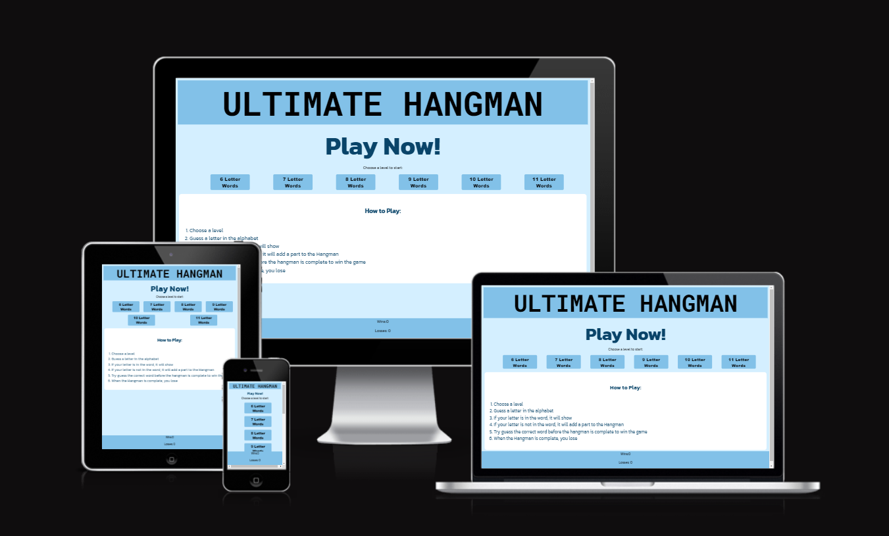
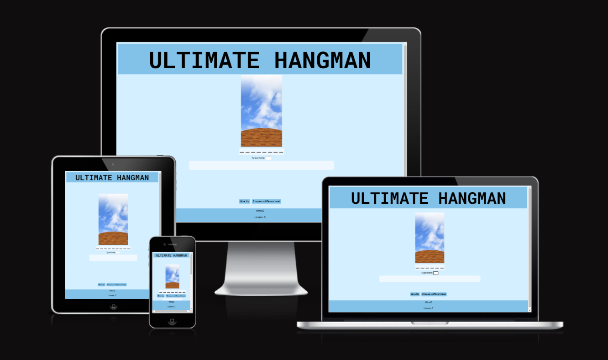

# Ultimate Hangman

Ultimate Hangman is a classic hangman game. Ultimate Hangman includes different difficulty levels and will lead to lots of fun for all players. Anyone who can read can play this game from children, to adults, to seniors!
 

## Features 

#### Level Buttons
Allows the user to intuitively pick their preferred difficulty level.

#### Instructions
Instructions how to player for a user who is new to the hangman game.

#### Game Area
The game area includes an image of the hangman, an input for the user to enter the letter they would like to guess, and a box showing the letters guessed which are not in the word.

#### Give up and Change level Buttons
* Give Up - generates a new game of the same level.
* Choose Different Level - takes user back to the first pae with the different level buttons.

#### Score Area
A footer that keeps track of how many games the user wins and loses and shows the updated scores.

### Features Left to Implement

- An on-screen keyboard

## Testing 

- All buttons work as expected.
- Game functions as expected
- Score updates when it is supposed to

- I tested my website on the following browsers to ensure it works in different browsers:
  - Chrome
  - Firefox
  - Microsoft Edge

- When I first created the website, the two pages were on two different pages of html, however the score wouldn't carry over from one page to the next as the Javascript reloaded. I put the pages in divs instead, and to switch pages I switch the style visibility.

- On larger screens, the elements overlapped slightly, so i added a media query.

- On the first page of the website, the buttons layout changes depending on the width of the page.

### Validator Testing 

- HTML
  - No errors were returned when passing through the official [W3C validator](https://validator.w3.org/nu/?doc=https%3A%2F%2Frochilaz123.github.io%2Fultimate-hangman%2F)
- CSS
  - No errors were found when passing through the official [(Jigsaw) validator](https://jigsaw.w3.org/css-validator/validator?uri=https%3A%2F%2Frochilaz123.github.io%2Fultimate-hangman%2F&profile=css3svg&usermedium=all&warning=1&vextwarning=&lang=en)
- Javascript
  - Passed through JS Hint with no significant issues.

## Deployment

TThis section describes the process I want through to deploy my project to Github Pages:

- The site was deployed to GitHub pages. The steps to deploy are as follows: 
  - In the GitHub repository, navigate to the Settings tab 
  - From the source section drop-down menu, select the Master Branch
  - Once the master branch has been selected, the page will be automatically refreshed with a detailed ribbon display to indicate the successful deployment. 

The live link can be found here - https://rochilaz123.github.io/ultimate-hangman/

## Credits 

### Media

The Hangman images were taken from the below source:
Author: Marc Oliveras
Email: admin@oligalma.com
Website: http://oligalma.com 

